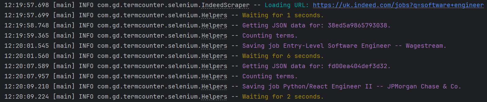
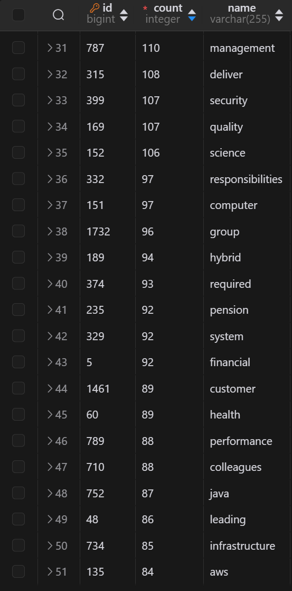
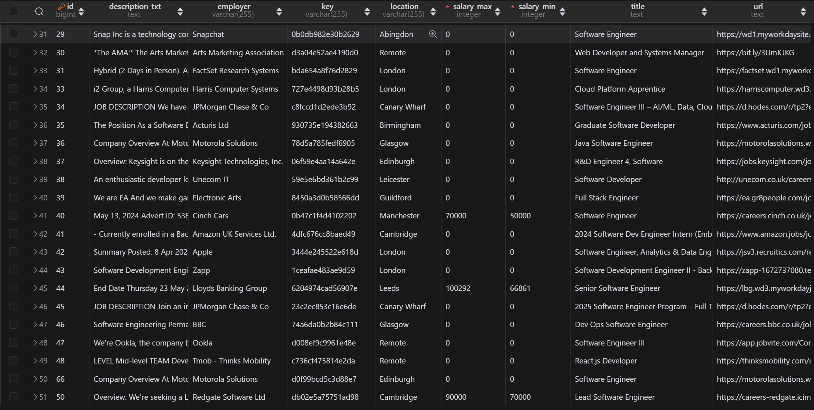

# termcounter

A job data processing API that counts the number of times words appear in job descriptions.

## Motivation

In order to keep track of the most popular technologies used in the tech industry and to know what to focus my upskilling efforts on, there was a need for building a tool that allows me to process data in the job applications according to my own needs.

I chose Spring Boot to build a robust and maintainable API that does the data processing. E.g. we can exclude words we're not interested in counting. Using this approach we can write decoupled scraping code for various sites using various methods. Because of the nature of web scraping the scraping code should be quick, simple and disposable with the only purpose of requests to the API with the scraped data.

Currently there is an implementation for Indeed that is using Selenium and the Chrome debugging protocol to control a browser and send scraped data to the API. The job data is extraced straight from their JSON API.

## Technologies

- Java Spring Boot
- Selenium
- Testcontainers
- REST Assured

## Usage

- Add `.env` if not present
- Run the DB: `docker run --name my-postgres -e POSTGRES_PASSWORD=mysecretpassword -d -p 5432:5432 postgres`
- Run `TermcounterApplication` to start the server
- Run Chrome in desktop with the debugger port open
- Run `IndeedScraper`
  - Although there is artificial randomised throttling built in, be respectful with the number of requests sent
  - The start page and the number of pages to go through can be set in `IndeedScraper` (TODO: Extract this to some sort of config)

## Troubleshooting

- If the requests fail, copy the headers to `request.js` from a real request in the devtools
